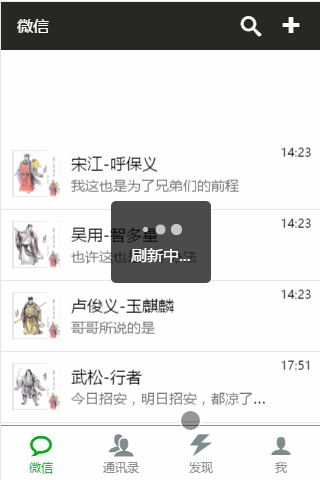
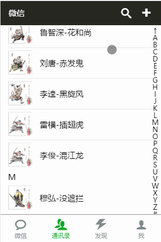
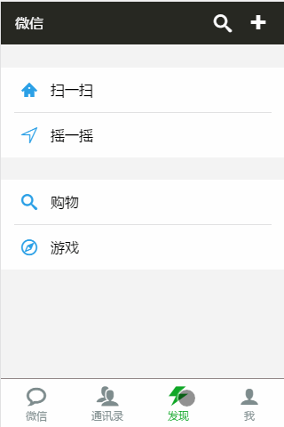
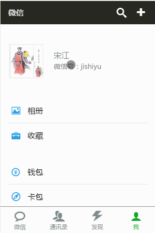
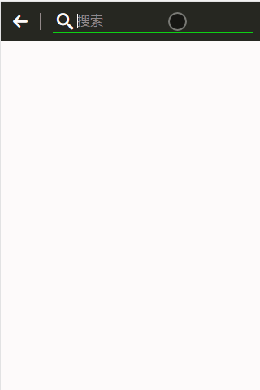
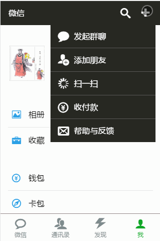

# WeChat

> 一个基于 Vue2.× 的单页面应用

### 安装步骤

``` bash
# 安装依赖包
npm install

# 运行实例，访问：http://localhost:8080 即可
npm run dev

# 压缩源码并打包，终极代码在 dist 目录下
npm run build

```

---

### 项目说明
1. [简要](#简要)
2. [微信](#微信)
3. [通讯录](#通讯录)
4. [发现](#发现)
5. [我](#我)
6. [搜索](#搜索)
7. [添加](#添加)
8. [部署](#部署)

---

### 简要

```
这是一个模仿微信的实例。
整个实例使用了 vue2.x 开发栈的大部分技术。
包括基本的指令、vue-router、vuex等等。
```

[回顶部](#wechat)

---

### 微信


**本页功能：**

1. 展示最近通讯列表
2. 下拉刷新列表

**技术实现：**

1. 列表展示，使用 vue 内置指令 **v-for** 渲染页面，数据来自服务端。
2. 下拉刷新，使用 [better-scroll](https://github.com/ustbhuangyi/better-scroll) 触发下拉事件，调用 [mint-ui](http://mint-ui.github.io/docs/#!/zh-cn) 的 Indicator显示刷新等待，当服务器返回数据并关闭 Indicator

[回顶部](#wechat)

---

### 通讯录


**本页功能：**

1. 展示通讯录列表
2. 长按联系人弹出**修改备注**框
3. 右侧栏点击或长按快速定位联系人

**技术实现：**

1. 列表展示，使用 vue 内置指令 **v-for** 渲染页面，数据来自服务端

2. 修改备注

  ```
  1. 使用 mousedown 和 touchstart 事件监听**按下**动作
  2. 启动一个500毫秒的**定时器**准备启动弹框
  3. 使用 mouseup 和 touchend 事件监听**松手**动作，**松手**时关闭**定时器**
  
  说明：如果按下不足500毫秒而松手时，虽然定时器已启动，但松手立刻将定时器关闭，由此实现长按功能。
  ```

3. 右侧栏快速定位

  ```
  布局，字母列表要求： 纵向自适应
    1. 字母列表绝对定位于右侧，同时固定宽度和高度
    2. 对 ul 进行 flex 布局，设置 flex-direction: column
    3. 最后每一项 flex: 1 由此实现纵向列表“自适应”目标

  字母弹框要求： 屏幕上下左右居中
    1. 字母弹框面板（包裹字母弹框）fixed 定位，固定宽高 100%
    2. 对面板进行 flex 布局，设置 align-items: center; justify-content: center
    3. 由此实现字母弹框，在屏幕上下左右居中目标
  
  vue实现，弹框要求： 按下时（不松手）弹出所选字母以预览，松手时关闭字母预览
    1. 对字母列表绑定 mousedown 和 touchstart 事件，监听**按下**动作
    2. 按下时触发字母弹框
    3. 对字母列表绑定 mouseup 和 touchend 事件，监听**松手**动作
    4. 松手时即关闭字母弹框
    5. 由此实现**按下**预览，**松手**关闭的目标
  ```

4. 额外说明
  - 在列表底部有个面板，显示当前联系人总数，总数依赖联系人列表的总数。在进入本页后，第一件事是获取最新联系人列表（从后台），此时联系人总数还无法得知，所有联系人总数面板应当关闭，直到列表获取完毕，数据被渲染完时，才显示联系人总数面板。

[回顶部](#wechat)

---

### 发现


**本页功能：**

  - 展示进入页面开场动画（此动画不优美，只在表述进入动画功能）
    搜索页面也有开场动画

**技术实现：**

  ```
  首先，“发现”页和“搜索”页属于同级路由
  由此它们拥有相同的渲染目的地，即 router-view 标签位置相同
  于理来说它们的进入动画该一致，而实际并不一致

  实际上在 router-view 标签外层包裹了 transition 标签，并且实用了动态过渡功能。
  光如此还不够，必须再使用“路由”监听功能，对每一次路由进行分析（来自哪里，将去哪里），从而得知路由的动向，
  然后“动态”设置 transition 的 name 值，由此实现不同页面开场动画不同的目标
  ```

参考：[过渡动效](http://router.vuejs.org/zh-cn/advanced/transitions.html)

[回顶部](#wechat)

---

### 我


**本页功能：**

1. 展示关于我的相关功能
2. 展示个人信息
3. 修改昵称
4. 修改性别

**技术实现：**

1. 展示关于我的相关功能

  ```
  1. 进入页面
  2. 从后台获取账户信息
  3. 将账户信息存储 store（vuex），进行状态信息跟踪
  ```

2. 展示个人信息

  ```
  1. 点击“头像栏”，进入个人信息页面（逻辑子页面）
  2. 账户数据从 store（vuex）中读取
  3. 展示账户信息在对应的标签下
  4. 点击左上角“返回”按钮，返回上一页，
     使用 this.$router.go(-1) 修改浏览器历史，
     从而返回上一页
  ```

3. 修改昵称

  ```
  1. 点击“昵称栏”，进入昵称修改页面（逻辑子页面）
  2. 修改昵称，默认带入当前昵称到修改框中，如果有修改动作，点亮“保存”按钮
  3. 点击“保存”，将修改后的昵称信息同步更新到 store（vuex）中
  4. 点击左上角“返回”按钮，返回上一页，使用 this.$router.go(-1) 修改浏览器历史，从而返回上一页
  5. 返回到个人信息页面，此时看到昵称以被修改，因为个人信息页面数据从 store（vuex）中获取
  ```

4. 修改性别

  ```
  1. 点击“性别栏”，弹出性别修改弹框
  2. 点击灰暗处即刻关闭修改弹框，同时数据未做任何修改
  3. 点击男或女，弹框立刻消失，同时修改后的数据立刻体现在个人信息页面，因为选择了性别后，
     会将数据更新到 store（vuex）中，所以呈现出数据被更新的效果。
  4. 性别弹框使用 mint-ui 的 Radio 组件
  ```

**特别说明:**
  
1. 以上逻辑上的子页面，实际是并行组件，并非嵌套
2. 如果是并行组件，那么在浏览器地址栏更改路由即可跳转到任何页面
3. 因为只有进入“我”的页面，才能进入“个人信息”等页面，它们拥有”逻辑上的“父子关系。所以浏览器**暴力**更改路由是**不合法**的。
4. 为了实现**逻辑父子关系**，在进入**子页面**时，在导航钩子 beforeRouteEnter 中进行过滤筛选

参考：[导航钩子](http://router.vuejs.org/zh-cn/advanced/navigation-guards.html)

[回顶部](#wechat)

---

### 搜索


**本页功能：**

1. 实时搜索联系人
2. 点“X”删除所有输入内容
3. 输入不为空串时，显示“X”按钮
4. 每次进入页面，无残留上次搜索记录

**技术实现：**

1. 实时搜索

  ```
  1. 使用 watch 功能，实时监听数据变化
  2. 在监听函数中触发后台搜索功能
  3. 标记搜索结果中的关键字（输入框输入）的颜色
  4. 更改 v-for 绑定的变量，让 vue 数据驱动完成列表重绘
  ```

2. 点“X”删除所有输入内容

  ```
  1. 重置输入框绑定变量值为“空串”，从而隐藏“X”元素
  2. 清空搜索结果列表数据，从而隐藏搜索结果面板
  ```

3. 输入不为空串时，显示“X”按钮
  
  ```
  使用 watch 功能，监听输入框绑定变量，若输入不为空串时，更改“X”按钮 v-show:**true**，从而实现显示“X”按钮的目标
  ```

4. 每次进入页面，无残留上次搜索记录
  
  ```
  首先，所有路由页面都使用 keep-alive 包裹，实现内存缓存组件实例，提升用户体验的效果。
  其次，当离开页面时，会触发 deactivated 钩子，在 deactivated 钩子做清空操作即可。
  ```

参考：[deactivated](http://cn.vuejs.org/v2/api/#deactivated), [activated](http://cn.vuejs.org/v2/api/#activated)

[回顶部](#wechat)

---

### 添加


**本页功能：**
  
  - 弹出添加面板，在不同的页面皆可以使用

**技术实现：**

1. 将面板 fixed 布局，固定宽高为屏幕大小
2. 面板中包含菜单栏，同时绝对定位菜单到指定位置
3. 设置“+”元素的 index: 10
4. 最后触发一个函数，动态更改一变量，使用 v-show 指令来控制面板的显示或隐藏

[回顶部](#wechat)

---

### 部署

本应用路由采用 HTML5 History 模式，在部署到生产时，需要 web 服务器提供些支持，否则当用户刷新浏览器时，会出现找不到页面的尴尬场面。

参考：[HTML5 History 模式](http://router.vuejs.org/zh-cn/essentials/history-mode.html)

[回顶部](#wechat)

---